<div align="center">

# Open Visualization Protocol

### The world's first design system built for AI agents.

**Paste one block into your agent and it draws pixel-identical, honest
charts. 74 chart skills x 16 design languages = 1,184 ready-made
visuals, every one verified to the byte.**

[](PROTOCOL.md)
[](TAXONOMY.md)
[](catalogue/languages/INDEX.md)
[](tools/validate.py)
[](tools/render.py)
[](LICENSE)

[Manifesto](MANIFESTO.md) · [Protocol](PROTOCOL.md) ·
[Chart skills](TAXONOMY.md) · [For AI agents](SKILL.md) ·
[Implement a renderer](docs/implement.html) · [Contribute](CONTRIBUTING.md)


**Every visual on this page was rendered by the protocol itself.**
*No screenshots, no mockups, no manual editing: each image re-renders
byte-identical from the JSON in this repository, and 3,179 automated
checks block the repo if a single byte drifts.*

</div>

---

## Same data. Same instruction. Sixteen organizations.

This is the trick nobody else does. One chart spec, one data file, and
sixteen complete visual identities, each with its own philosophy,
typography, palette, and communication rules. Change two characters
(`DL-02` to `DL-08`) and the same page becomes a boardroom brief, a
legal chronology, a scientific readout, or a control-room wall:

| `in DL-01` boardroom | `in DL-03` analyst | `in DL-08` control room | `in DL-13` editorial |
|---|---|---|---|
| 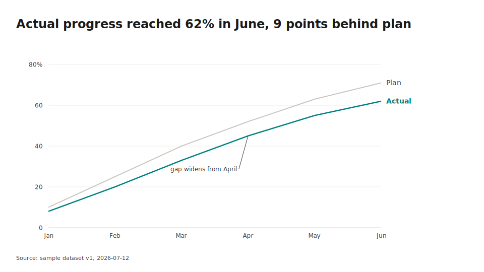 | 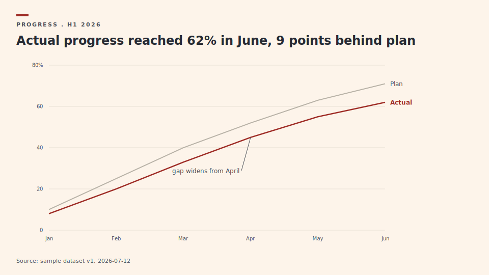 | 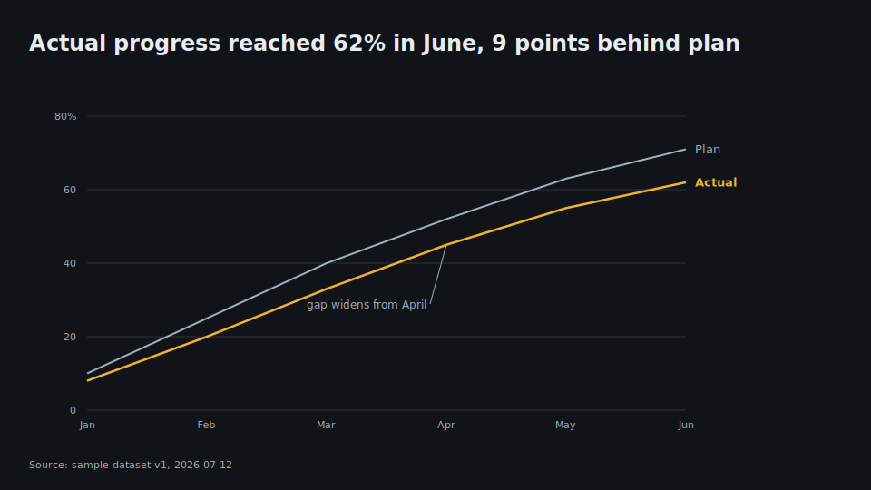 | 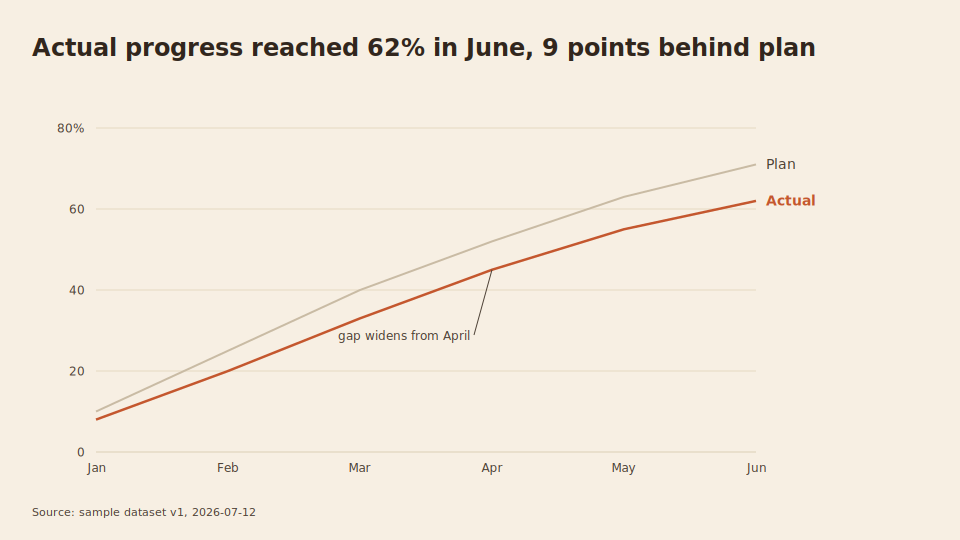 |

Identical numbers. Four different rooms. Zero manual design work.

## Why your agent needs this

Ask an LLM for "a clean, professional chart" and you get a plausible
one: pleasant colors, a random axis, a legend nobody needed, sometimes
a baseline that lies. Ask again tomorrow and you get a different one.
Same request, different chart, forever.

What that costs you today:

```text
You:    "Make a professional progress chart for the weekly review"
Agent:  *invents a color scheme*
        *picks a chart type by vibes*
        *cuts the y-axis at 40 to make the trend look dramatic*
        *adds a legend for one series*
You:    "...that's not what it looked like last week"
```

What it looks like with OVP:

```text
You:    "Render CH-TIM-02 in DL-02 with data.json"
Agent:  *follows a 130-line exact specification*
Result: the same pixels as last week, next week, and on your
        colleague's machine. Zero baseline. Direct labels. Verified.
```

The design judgment moved out of every conversation and into a
protocol: written once, argued once, versioned, and enforced by a
validation gate. Everything after that is reproduction, not
re-invention.

## For AI agents — one line

Paste this into your agent's chat. It reads the skill file and knows
how to resolve questions to charts, charts to languages, and languages
to exact pixels:

```
Read https://raw.githubusercontent.com/babarda/open-visualization-protocol/main/SKILL.md and follow it.
```

That is the whole install. [SKILL.md](SKILL.md) teaches the resolution
chain; [REGISTRY.json](REGISTRY.json) is the knowledge graph it
queries; the blocks are the payloads it obeys.

## For humans — 60 seconds

Every chart ships as a copy-paste block. No dependency, no API key:
the block IS the skill.

**Claude Code / Claude.ai** — one chart, one identity, straight into
your rules:

```bash
git clone https://github.com/babarda/open-visualization-protocol ovp
cat ovp/blocks/design-system/CH-RNK-01_DL-02.md >> CLAUDE.md
```

Or the whole catalogue as a skill:

```bash
mkdir -p ~/.claude/skills/ovp
cp ovp/SKILL.md ~/.claude/skills/ovp/
cp -r ovp/blocks ovp/REGISTRY.json ovp/QUESTIONS.md ovp/DECIDER.md ~/.claude/skills/ovp/
```

**Cursor / Codex / Copilot / any agent** — same blocks, your rule
file:

```bash
cat ovp/blocks/skill/DL-02.md ovp/blocks/skill/CH-TIM-02.md >> AGENTS.md   # or .cursorrules
```

## For developers — see it live in 30 seconds

```bash
git clone https://github.com/babarda/open-visualization-protocol ovp && cd ovp

# render a chart: exact spec + design language + data -> SVG
python tools/render.py --spec specs/CH-TIM-02.json --tokens tokens/DL-03.json \
    --data golden/CH-TIM-02/data.json --out chart.svg

# re-render it with a different language: same data, new identity
python tools/render.py --spec specs/CH-TIM-02.json --tokens tokens/DL-08.json \
    --data golden/CH-TIM-02/data.json --out chart-dark.svg

# browse the full gallery locally
python -m http.server 8000 --directory docs   # open http://localhost:8000

# prove determinism yourself: 3,179 checks, byte-level
python tools/validate.py
```

The SVG renderer is Python standard library only. The PPTX transpiler
(`pip install python-pptx`) turns the same specs into native
PowerPoint shapes, member-identical on every run.

## Sixteen design languages, not sixteen themes

Each language is a complete communication system: a philosophy
(civilization, principle, motto, laws), a schema-enforced
**constitution** (narrative style, information density, annotation and
highlight policy, charts per page, decision style), and rendering
behavior that actually changes. The legal language refuses highlight
emphasis. The scientific languages tighten the type scale. The
executive ones enlarge it. All deterministic, all golden-locked.


All sixteen, with palettes, constitutions, and one-click copy blocks:
**[the languages gallery](docs/languages/index.html)**.

## 74 chart skills, coded by message

Charts are coded by what the message is, never by shape. Every entry
carries use-when, not-when, "see instead" exits, honesty rules,
anti-patterns, a QA checklist, a data schema, and golden renders in
all 16 languages:

| | | |
|---|---|---|
| 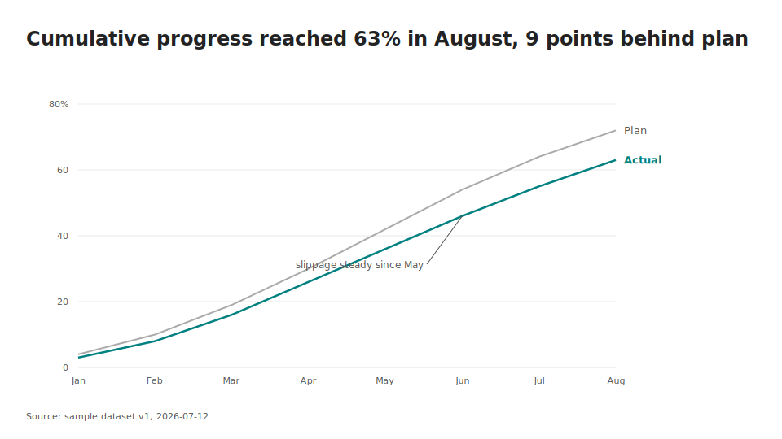 | 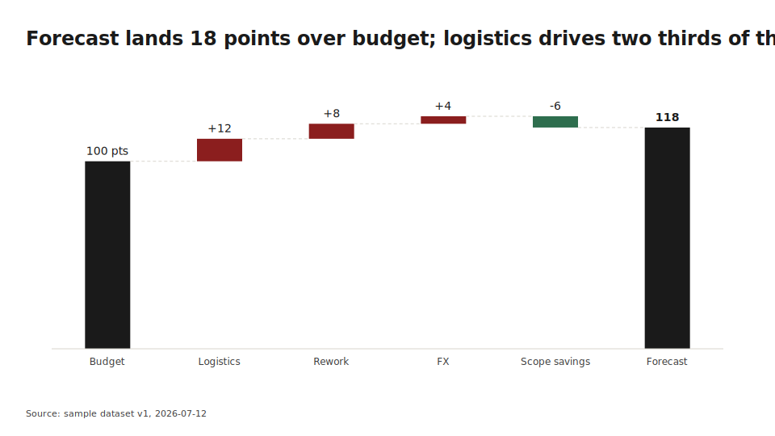 | 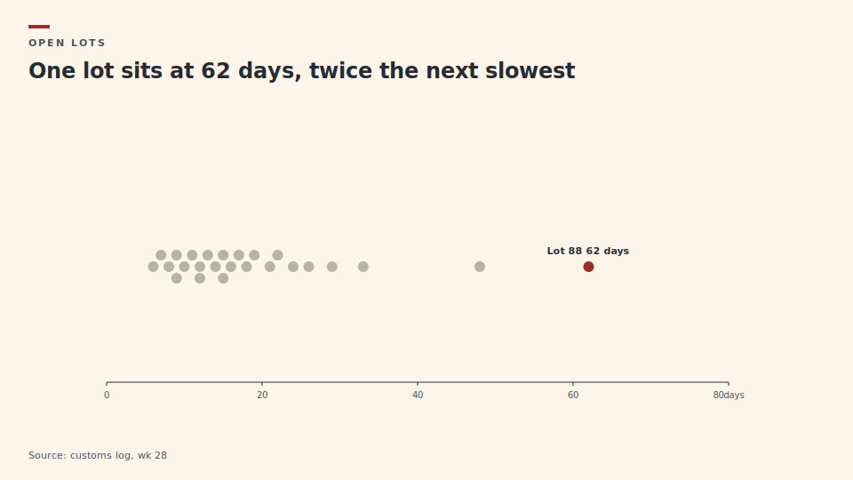 |
| 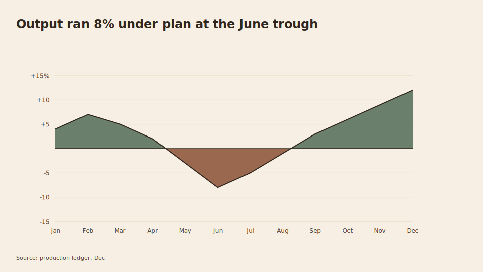 | 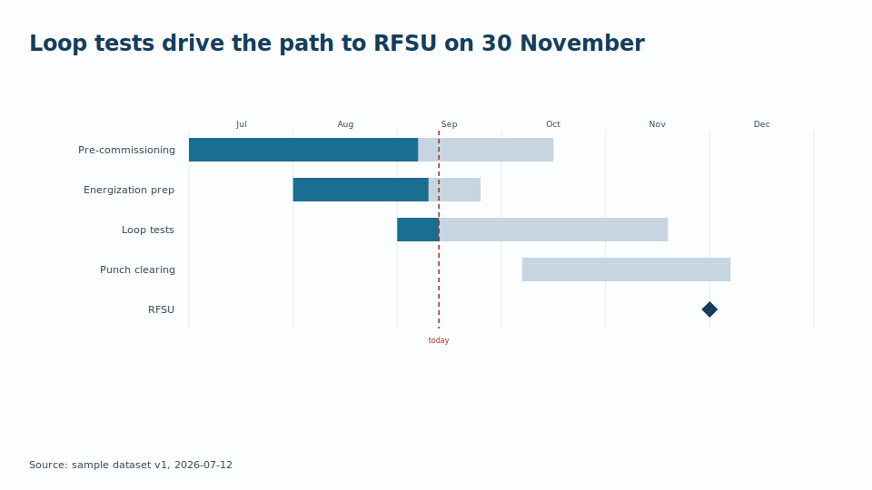 | 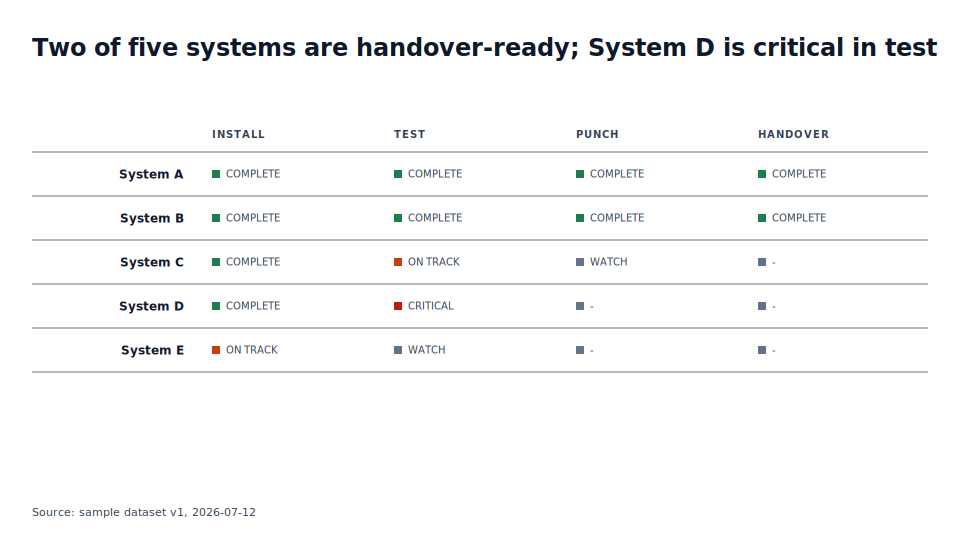 |
| 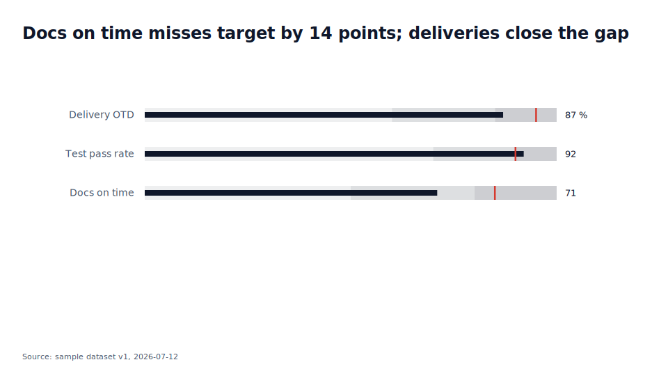 | 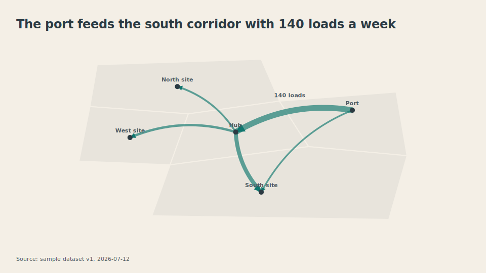 | 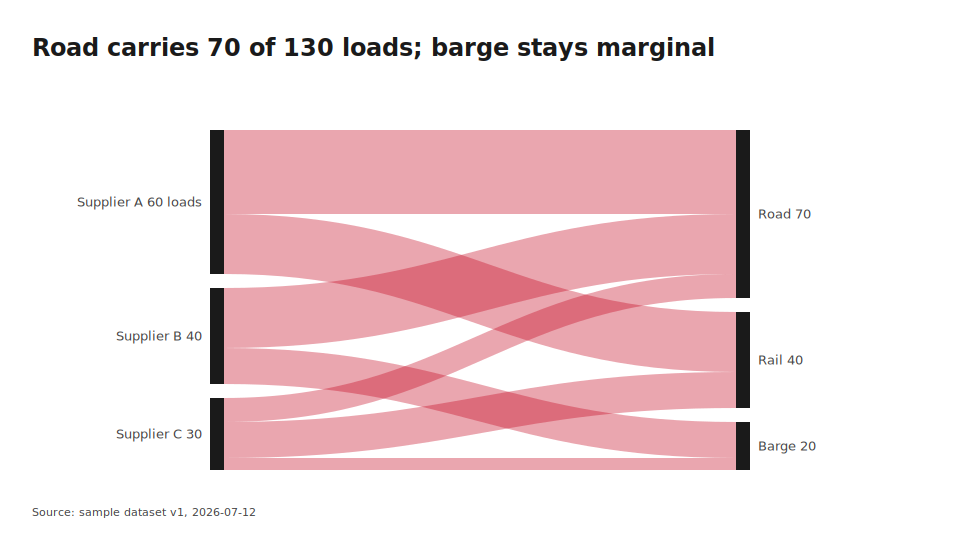 |

| Family | What the message is | Skills |
|---|---|---|
| Ranking | who is biggest, ordered | 6 |
| Magnitude | how big things are | 9 |
| Change over time | how it moved | 15 |
| Part-to-whole | how a total splits | 10 |
| Deviation | distance from plan, budget, zero | 5 |
| Distribution | how values spread | 10 |
| Correlation | how two measures relate | 7 |
| Spatial | where | 5 |
| Flow | movement between states | 4 |
| Tables | exact values readers look up | 3 |

Full map with statuses: **[TAXONOMY.md](TAXONOMY.md)**. Even the
charts we warn against (pies, gauges, radars, chords) ship with specs,
so when someone demands one, your agent draws the least dishonest
version on record.

## Built for AI agents first

Agents never read the handbook. They load three small things:

1. **[REGISTRY.json](REGISTRY.json)**: the knowledge graph. A chart
   knows which business questions it answers, which analytical
   patterns recommend it, which recipes use it. One lookup, no crawl.
2. **One language block + the matched chart block(s)** from `blocks/`:
   self-contained runtime payloads, generated from the canonical specs
   and drift-gated.
3. **A narrative skeleton** (claim, evidence, cause, action, owner) so
   the finding is told, not just drawn.

Token efficiency is a protocol objective (PROTOCOL 2.1), and
[llms.txt](llms.txt) hands crawling agents the map.

## Honest by construction

Zero baselines. Direct labels, never legends. Declared inputs only: no
silent trend lines, no silent smoothing, no unstated normalization, no
random jitter (even the beeswarm packs deterministically). Deltas
colored by declared good-direction, never by sign. And the validator
enforces what style guides never could: waterfalls must reconcile,
cumulative curves must never decrease, rank columns must be
permutations, five-number summaries must be ordered.

## Who uses this for what

**Developers**: report pipelines in CI, batch chart generation from
databases, PowerPoint automation without PowerPoint, pixel-stable
visual regression suites.

**AI agents**: dashboards and slide visuals from user prompts that
come out identical across sessions, models, and vendors; charts that
survive a design review on the first pass.

**Teams**: one visual identity across every deck and dashboard,
enforced by a gate instead of a brand police; weekly deliverables that
render identically forever (see the [recipes](docs/recipes.html)).

## What is in the box

```
PROTOCOL.md, RFC-0001.md    the normative reference, v1.0, frozen
MANIFESTO.md                why, and the seven laws that never break
SKILL.md                    the one-line agent install
REGISTRY.json               the machine index and knowledge graph
specs/ tokens/ questions/   canonical JSON: 74 charts, 16 languages,
patterns/ narratives/       12 business questions, 8 patterns,
components/ recipes/        4 narrative skeletons, 11 components,
                            6 full-page recipes
blocks/                     copy-paste skills, two flavors, generated
golden/                     1,200+ golden renders: the conformance suite
schema/                     JSON Schemas incl. per-chart data schemas
tools/                      reference implementation: SVG renderer,
                            PPTX transpiler, recipe compositor, QA gate
docs/                       the documentation site (GitHub Pages ready)
```

**Implement your own renderer** from the published spec alone:
determinism contract, conformance levels, schemas, and the golden test
suite are in [docs/implement.html](docs/implement.html). That is this
project's success criterion: an independent team ships an
OVP-compatible implementation without asking us anything.

## Ecosystem

Companion repos built on the frozen v1.0 spec, each generated from the
canonical tokens and gated against drift:

- [report-themes](https://github.com/babarda/report-themes): the 16
  design languages exported as ready-to-use themes for Power BI, Excel
  (.thmx), matplotlib, plotly, Vega-Lite, and CSS. One download,
  matching reports everywhere.
- [which-chart](https://github.com/babarda/which-chart): say what you
  want to show, get the right chart, its data shape, and when not to use
  it. An interactive chooser page, a printable A3 decision poster, and a
  paste-in agent skill, all generated from this canon.
- [ai-chart-skills](https://github.com/babarda/ai-chart-skills): a
  focused skill pack (chart-chooser, honest-charts, deterministic-slides,
  exec-deck) with Cursor and AGENTS.md mirrors, so an agent picks the
  right chart, refuses a dishonest one, and renders it the same way every
  time.

- [json2chart](https://github.com/babarda/json2chart): `pip install
  json2chart`. Render any of the 74 charts to SVG or PPTX from the
  command line or Python, choose a design language for an audience, all
  deterministic and byte-identical to this protocol's goldens.

More are on the way: an MCP server, a live playground, and a
data-to-deck compiler.

## Contributing

Codes are permanent, the gate is law, and every admission rule is
written down: [CONTRIBUTING.md](CONTRIBUTING.md). New languages need
an occasion no existing language serves and one signature move. New
charts need a message no existing entry carries and an honest spec.

If OVP saved you a design argument this week, star the repo: stars are
how the next person lost in "make it look professional" finds it.

---

<sub>Keywords: AI visualization skills, chart skills for LLM agents,
Claude chart skills, CLAUDE.md skills, agent skills, deterministic
charts, design language system, data visualization protocol, AI
generated dashboards, agent design system, Cursor rules charts, chart
grammar for AI, design tokens for charts, SVG chart renderer,
PowerPoint chart automation, honest data visualization, visualization
standard for AI agents.</sub>
